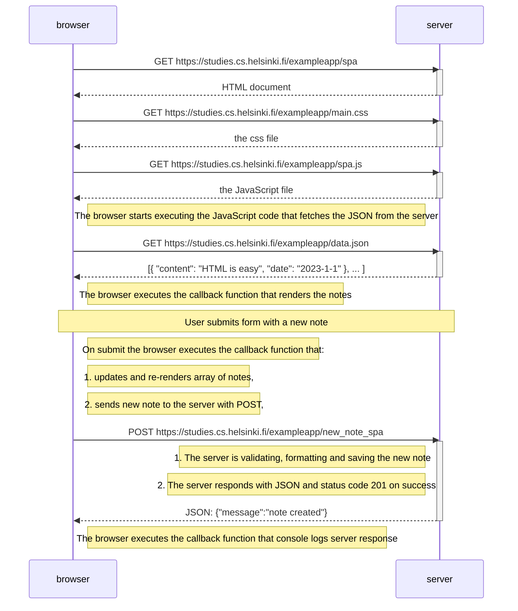

```mermaid
sequenceDiagram
    participant browser
    participant server

    browser->>server: GET https://studies.cs.helsinki.fi/exampleapp/spa
    activate server
    server-->>browser: HTML document
    deactivate server

    browser->>server: GET https://studies.cs.helsinki.fi/exampleapp/main.css
    activate server
    server-->>browser: the css file
    deactivate server

    browser->>server: GET https://studies.cs.helsinki.fi/exampleapp/spa.js
    activate server
    server-->>browser: the JavaScript file
    deactivate server

    Note right of browser: The browser starts executing the JavaScript code that fetches the JSON from the server

    browser->>server: GET https://studies.cs.helsinki.fi/exampleapp/data.json
    activate server
    server-->>browser: [{ "content": "HTML is easy", "date": "2023-1-1" }, ... ]
    deactivate server
    Note right of browser: The browser executes the callback function that renders the notes

    Note over server, browser: User submits form with a new note
    Note right of browser: On submit the browser executes the callback function that:
    Note right of browser: 1. updates and re-renders array of notes,
    Note right of browser: 2. sends new note to the server with POST,
    browser->>server: POST 	https://studies.cs.helsinki.fi/exampleapp/new_note_spa
    activate server
    Note left of server: 1. The server is validating, formatting and saving the new note
    Note left of server: 2. The server responds with JSON and status code 201 on success
    server-->>browser: JSON: {"message":"note created"}
    deactivate server
    Note right of browser: The browser executes the callback function that console logs server response
```
